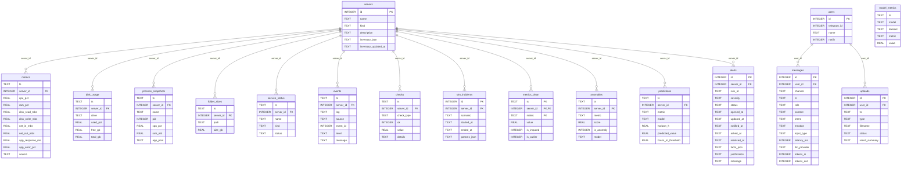

# ER-діаграма бази даних

Згенеровано автоматично з `data/oncall.db` командою `python -m core.db --er`. Не редагуйте вручну.

```mermaid
erDiagram
    servers {
        INTEGER id PK
        TEXT name
        TEXT kind
        TEXT description
        TEXT inventory_json
        TEXT inventory_updated_at
    }
    metrics {
        TEXT ts
        INTEGER server_id FK
        REAL cpu_pct
        REAL ram_pct
        REAL disk_read_mbs
        REAL disk_write_mbs
        REAL net_in_mbs
        REAL net_out_mbs
        REAL app_response_ms
        REAL app_error_pct
        TEXT source
    }
    disk_usage {
        TEXT ts
        INTEGER server_id FK
        TEXT drive
        REAL used_pct
        REAL free_gb
        REAL total_gb
    }
    process_snapshots {
        TEXT ts
        INTEGER server_id FK
        TEXT name
        INTEGER pid
        REAL cpu_pct
        REAL ram_mb
        TEXT app_pool
    }
    folder_sizes {
        TEXT ts
        INTEGER server_id FK
        TEXT path
        REAL size_gb
    }
    service_status {
        TEXT ts
        INTEGER server_id FK
        TEXT name
        TEXT kind
        TEXT status
    }
    events {
        TEXT ts
        INTEGER server_id FK
        TEXT log
        TEXT source
        INTEGER event_id
        TEXT level
        TEXT message
    }
    checks {
        TEXT ts
        INTEGER server_id FK
        TEXT check_type
        INTEGER ok
        REAL value
        TEXT details
    }
    sim_incidents {
        INTEGER id PK
        INTEGER server_id FK
        TEXT scenario
        TEXT started_at
        TEXT ended_at
        TEXT params_json
    }
    metrics_clean {
        TEXT ts PK
        INTEGER server_id PK, FK
        TEXT metric PK
        REAL value
        INTEGER is_imputed
        INTEGER is_outlier
    }
    anomalies {
        TEXT ts
        INTEGER server_id FK
        TEXT metric
        REAL score
        INTEGER is_anomaly
        TEXT model
    }
    predictions {
        TEXT ts
        INTEGER server_id FK
        TEXT metric
        TEXT model
        REAL horizon_h
        REAL predicted_value
        REAL hours_to_threshold
    }
    alerts {
        INTEGER id PK
        INTEGER server_id FK
        TEXT rule_id
        TEXT severity
        TEXT status
        TEXT opened_at
        TEXT updated_at
        TEXT notified_at
        TEXT acked_at
        TEXT resolved_at
        TEXT facts_json
        TEXT justification
        TEXT message
    }
    users {
        INTEGER id PK
        INTEGER telegram_id
        TEXT name
        INTEGER notify
    }
    messages {
        INTEGER id PK
        INTEGER user_id FK
        TEXT channel
        TEXT ts
        TEXT role
        TEXT content
        TEXT intent
        TEXT emotion
        TEXT input_type
        INTEGER latency_ms
        TEXT llm_provider
        INTEGER tokens_in
        INTEGER tokens_out
    }
    uploads {
        INTEGER id PK
        INTEGER user_id FK
        TEXT ts
        TEXT type
        TEXT filename
        TEXT status
        TEXT result_summary
    }
    model_metrics {
        TEXT ts
        TEXT model
        TEXT dataset
        TEXT metric
        REAL value
    }
    servers ||--o{ metrics : "server_id"
    servers ||--o{ disk_usage : "server_id"
    servers ||--o{ process_snapshots : "server_id"
    servers ||--o{ folder_sizes : "server_id"
    servers ||--o{ service_status : "server_id"
    servers ||--o{ events : "server_id"
    servers ||--o{ checks : "server_id"
    servers ||--o{ sim_incidents : "server_id"
    servers ||--o{ metrics_clean : "server_id"
    servers ||--o{ anomalies : "server_id"
    servers ||--o{ predictions : "server_id"
    servers ||--o{ alerts : "server_id"
    users ||--o{ messages : "user_id"
    users ||--o{ uploads : "user_id"
```
